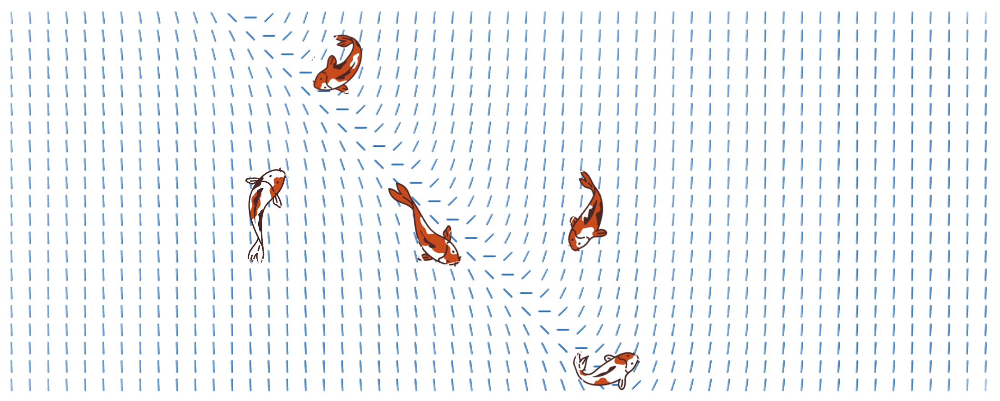

I am a Presidential Honors Scholar at NYU ('28) pursuing a dual major in Economics and Mathematics and minoring in Chinese Language. My on-campus roles include: 

<ol>
    <li> Co-Founder and President of <a href = 'https://petalnyu.github.io/petal-nyu/'>PETAL</a>, a tech policy/law/ethics club.
    <li> Cohort Leader for <a href="https://www.nyu.edu/students/getting-involved/leadership-and-service/volunteer-service/give-where-you-live.html">Give Where You Live</a>  </li>
    <li>Co-Director of the Journalism team at <a href = "https://www.nyusternedg.org/">NYU Stern Economic Development Group</a> </li> 
    <li> Dining Hall Coordinator for <a href = 'https://www.google.com/url?sa=t&source=web&rct=j&opi=89978449&url=https://www.instagram.com/twobirdsonestonenyu/%3Fhl%3Den&ved=2ahUKEwjclea8kqeRAxXmC3kGHdDQDSEQFnoECBgQAQ&usg=AOvVaw2YBzvCOoDhg1w9fAnlLBAe'>Two Birds One Stone</a>.
</ol>

Inspired by <a href = "https://www.kqed.org/news/11987286/ever-seen-a-koi-fish-on-the-sidewalk-artist-explains-hidden-meaning">Jeremy Novy</a>. Koi designed by  <a href="http://www.freepik.com">Freepik</a>. Slope field generated with <a href = "https://www.desmos.com/calculator/eofv8lpzd8"> Desmos</a>. 
